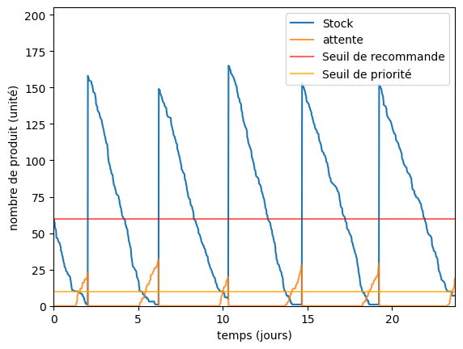

## Abstract
Formalisé par Wilson en 1934, la gestion de stock est une discipline dont les intérêts n'ont jamais été aussi pertinents avec les enjeux actuels. Ce document est le rapport d'une simulation d'une politique de gestion des stocks à 3 paramètres dans le cadre de l'étude d'un magasin à 2 canaux (commande en ligne et en magasin), effectué pour l'UE CL04. Ce rapport se concentre principalement sur l'importance du paramètre K, le niveau critique qui donne priorité aux commandes en magasin, sur la gestion des stocks et les coûts associés.

## Simulation du système
Le système décrit dans ce rapport est présenté dans le [sujet](https://github.com/Kiwy3/Stock_Simulation/blob/main/0.old_and_docs/CL04_project_P24.pdf). Il s'agit de la gestion d'un magasin à un seul produit, possédant 2 canaux de ventes : en ligne et en magasin. Une commande en ligne peut être mise en attente et livrée en retard, une commande en magasin est perdue si un client arrive et que le magasin est en rupture. **En faisant l'hypothèse qu'aucune commande n'arrive exactement en même temps**, la simulation des arrivées des commandes s'effectue avec une loi exponentielle pour les temps d'inters-arrivés et une loi de Bernoulli pour définir le type de la commande.  
La figure 1 décrit la dynamique du système telle qu'elle sera programmée par la suite. Les paramètres nommés dans la dynamique seront définis dans la table 1.

*Dynamique du système*

## Programmation
La programmation pour ce projet est effectuée en [**python**](https://www.python.org/), utilisant principalement les librairies [pandas](https://pandas.pydata.org/), [numpy](https://numpy.org/doc/stable/index.html) et [math](https://docs.python.org/3/library/math.html). L'ensemble des fichiers utilisés et le code du projet sont en annexe ainsi que sur un [répertoire Github](https://github.com/Kiwy3/Stock_Simulation/tree/main) contenant l'ensemble du projet.  
Pour simplifier le déroulement et l'exécution, la programmation est répartie sur 5 fichiers différents : 
- *0.param.py* : génère un fichier "param.json" qui permet à chaque fichier d'utiliser les mêmes paramètres
- *1.simulation.py* : simule l'évolution du stock et sauvegarde 2 fichiers par valeurs de K, un échéancier et une table avec les retards (dossier "1.Instances")
- *2.cost.py* : ajoute les différents coûts à l'échéancier puis le sauvegarde (dossier "2.Instances_costs")
- *3.results.py* : calcule les indicateurs utilisés par la suite pour chaque valeur de K, et les sauvegarde dans le fichier "results.csv"
- *4.plotting.py* : génère les graphiques utilisés pour ce rapport

## Analyse de l'instance d'origine
Dans le cadre de cette étude, nous allons tout d'abord observer une première instance, avec ces paramètres :

| Nom des paramètres | Description | Valeurs |
|--------------------|-------------|---------|
| $\lambda_1$        | Simulation commande en ligne | 15      |
| $\lambda_2$        | Simulation commande magasin | 30      |
| L                  | Délai de livraison            | 2 jours |
| W                  | Délai non pénalisé de retard | 1 jour  |
| Q                  | Quantité de recommande        | 180 pièces |
| r                  | Seuil de recommande           | 60 pièces |
| **K**              | **Seuil de priorité**         | **10 pièces** |
| F                  | Coût de passation            | 18 €    |
| h                  | Coût de stockage             | 0,05 €  |
| p                  | Coût de perte de vente       | 20 €    |
| b                  | Indemnité journalière de retard | 5 €   |

*Tableau 1 : Paramètres de la simulation*

Pour étudier l'influence du paramètre K, nous allons tout d'abord observer le fonctionnement dans le détail avec K étant égal à 10. Pour cela, nous allons observer l'évolution du stock sur un horizon de 22 jours, sur la figure 2. 

*Figure 2 : Évolution du stock sur le début de l'instance*

Nous retrouvons sur cette figure l'ensemble des éléments clés de la dynamique : les pics de stock sont à 2 jours après les passages du stock sous le seuil de recommande. La quantité de stock en attente se met à augmenter une fois que le stock passe sous le seuil de priorité. Malgré une quantité de recommande valant 180, le stock ne passe que très rarement au-dessus de 150, montrant que les produits en attente permettent dès à présent de réduire le stock maximal (et sûrement le moyen par extension).

Nous pouvons également regarder des indicateurs précis pour évaluer la performance du système. Les indicateurs utilisés sont le **niveau moyen de stock**, le **pourcentage de perte en magasin**, **le pourcentage de retard en ligne** ainsi que le **coût total journalier moyen du stock**. Ce coût total inclut à la fois les coûts de passation de commande, de stockage, de pénalité de retard, de perte de vente en magasin et de stockage.

| Niveau moyen de stock | % de perte en magasin | % de retard en ligne | Coût total journalier |
|------------------------|-----------------------|----------------------|-----------------------|
| 65 pièces              | 8,01 %                | 0,66 %               | 31,8 €                |

*Tableau 2 : Indicateurs sur la première instance (K = 10)*

Sur ces résultats, nous pouvons noter certains points. Pour commencer, le niveau moyen du stockage n'est que très légèrement au-dessus du seuil de recommande, malgré une quantité de recommande valant 3 fois celui-ci. Cela vient entre autres des produits en attente qui vont réduire le stock maximal atteint après un approvisionnement de commande. Le seuil de priorité étant proche de 0, il est normal d'avoir beaucoup plus de perte que de produit en retard. Si on met que très tardivement un produit en attente, on a plus de risque d'avoir une rupture de stock, et cela réduit le stock.

Sur cette instance, nous pouvons à présent regarder du côté des coûts. Pour cela, nous observons sur la figure 3 le coût moyen pour voir sa tendance à se rapprocher du coût moyen général observé sur le reste de l'instance.

*Figure 3 : Évolution du coût moyen sur le début de l'instance*

On peut noter les différents pics qui correspondent aux passations de commandes, qui sont le plus gros coût du système. Au bout d'une quarantaine de jours, le coût moyen est déjà assez proche de la droite, et surtout cesse de croître contrairement aux premiers jours.

Ce qu'on a vu juste avant, c'est que les coûts de passation font fortement augmenter les coûts sur le début. Il est intéressant de regarder la répartition des coûts en fonction de nos 4 coûts (vente perdue, retard, passation, stockage), c'est le but de la figure 4.

*Figure 4 : Répartition des coûts en pourcentage*

Sur cette instance, le coût majoritaire est celui de la perte de vente potentielle, ce qu'on pouvait supposer avec les 8 % de pertes. Cela, croisé avec une perte de vente potentielle au prix fort (20 €), nous entraîne une perte très importante. C'est notamment ce coût-là qu'on va chercher à réduire pour réduire les coûts.

## Étude de l'influence du paramètre K sur le système
Pour rappel, le paramètre K correspond au seuil critique qui va affecter le comportement d'une vente en ligne. Si le stock est inférieur à K, une commande en ligne qui arrive va se mettre en attente. Cela va nous permettre de réduire les pertes de ventes potentielles qui vont affecter le magasin, au risque de générer des coûts suite à un retard d'une commande en ligne.

Pour commencer l'étude, nous pouvons tout d'abord observer les indicateurs vus sur la table 2 avec les autres valeurs de K.

| K  | Niveau moyen de stock | % de perte en magasin | % de retard en ligne | Coût total journalier |
|----|------------------------|-----------------------|----------------------|-----------------------|
| 0  | 67 pièces              | 16,95 %               | 0,01 %               | 58,7 €                |
| 10 | 65 pièces              | 8,01 %                | 0,66 %               | 31,8 €                |
| 20 | 64 pièces              | 1,48 %                | 3,69 %               | 12,3 €                |
| 30 | 67 pièces              | 0,21 %                | 8,77 %               | 9,0 €                 |
| 40 | 69 pièces              | 0,01 %                | 14,32 %              | 9,2 €                 |
| 50 | 72 pièces              | 0,00 %                | 20,08 %              | 10,5 €                |
| 60 | 74 pièces              | 0,00 %                | 26,67 %              | 12,4 €                |

*Tableau 3 : Indicateurs en fonction de K*

Le premier point à noter, c'est que le coût minimum est atteint avec $K = 30$, soit $K = \frac{1}{2} r$. Un seuil de priorité se trouvant à mi-chemin entre le seuil de recommande et 0 permettrait donc de réduire à la fois les pertes en magasin et le retard en ligne. Avec le niveau de détail, il est toutefois difficile de conclure autre chose que le fait que la valeur optimale de K soit entre 20 et 40. La différence entre les pénalités de retard et le coût d'une perte de vente potentielle explique que le coût total journalier n'augmente que très peu, même avec plus de 25 % de pièces qui arrivent en retard.

Comme auparavant, nous pouvons regarder le pourcentage que représente chaque coût en fonction de la valeur de K. Cela nous permet de voir plus dans le détail la répartition des coûts.

*Figure 5 : Évolution de la répartition des coûts en fonction de K*

Le coût de passation étant fixe sur les instances, son évolution montre l'évolution du coût total. Nous pouvons voir, suivant l'évolution des pertes et retards, l'inversion qui se produit entre le retard et les pertes de ventes d'une extrémité à l'autre. Cela nous permet de confirmer que le coût minimal se trouve lorsqu'on arrive à réduire en même temps les indemnités de retard et les pertes de ventes.

## Conclusion
Pour conclure, je vais synthétiser l'influence de K sur cette politique de gestion de stock. En **augmentant K**, il y a **plus de commandes en attentes** donc plus de retard, mais cela va **réduire drastiquement le nombre de ruptures de stock en magasin** et donc les coûts. Bien qu'étonnant, avec les paramètres actuels, cela **ne change que très peu le stock moyen**, même s'il est légèrement plus important lorsque K augmente.

Si nous voulons poursuivre l'étude, il pourrait être intéressant de diminuer l'écart entre les valeurs de K pour trouver l'optimal avec les paramètres donnés. De la même façon, une étude de la corrélation entre les paramètres de la gestion des stocks pourrait permettre de voir si le comportement de K est différent avec des paramètres différents.
